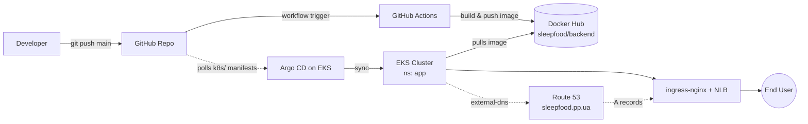
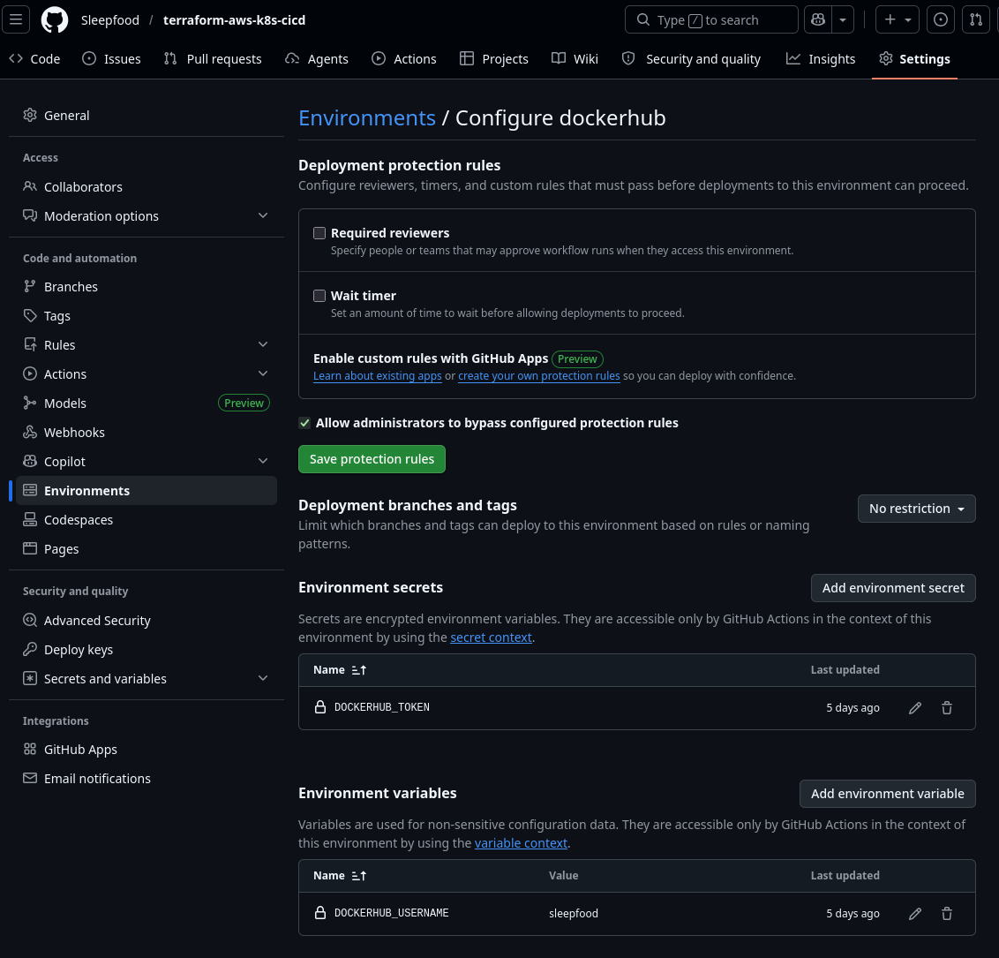
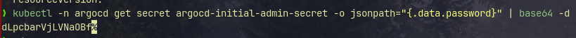
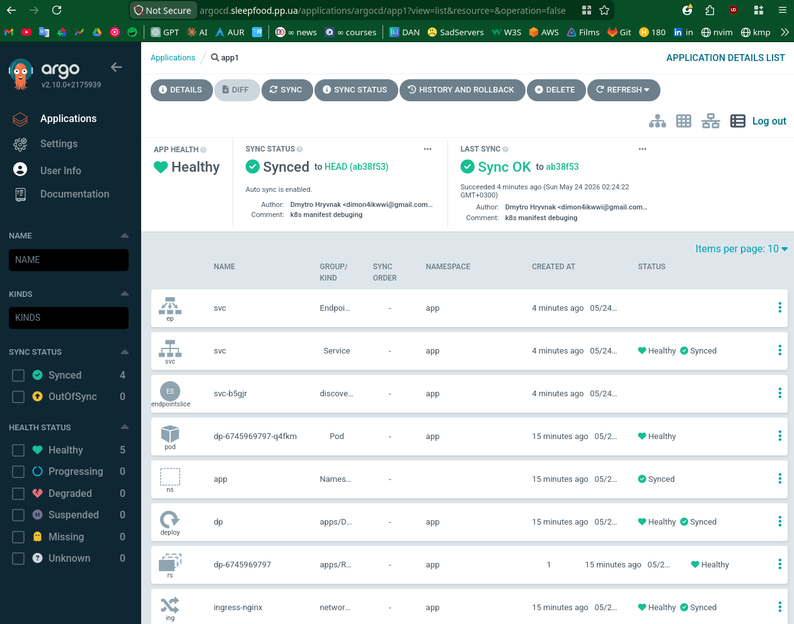
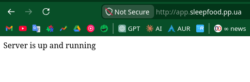
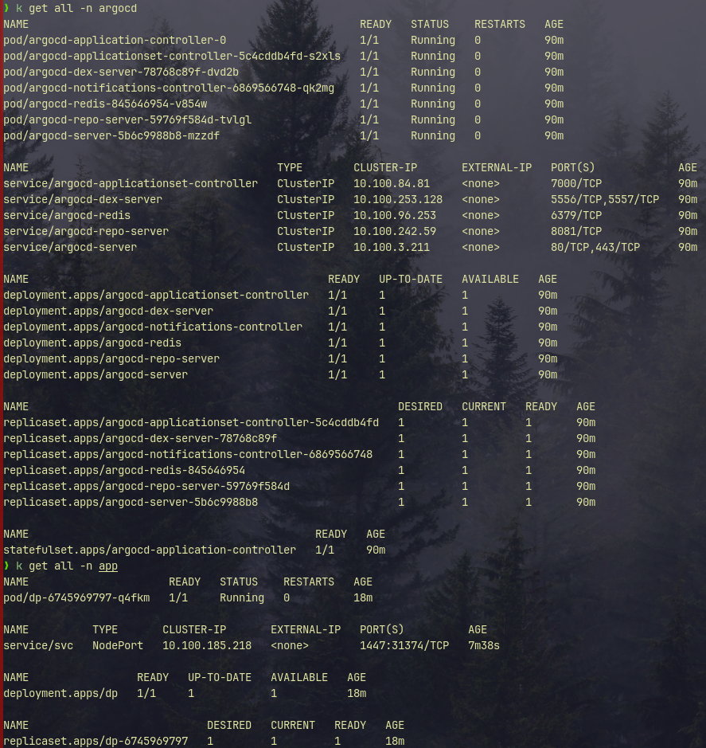
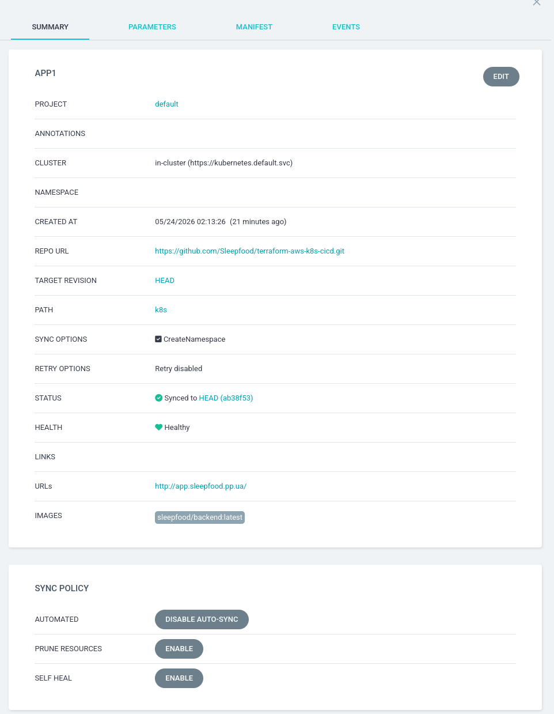
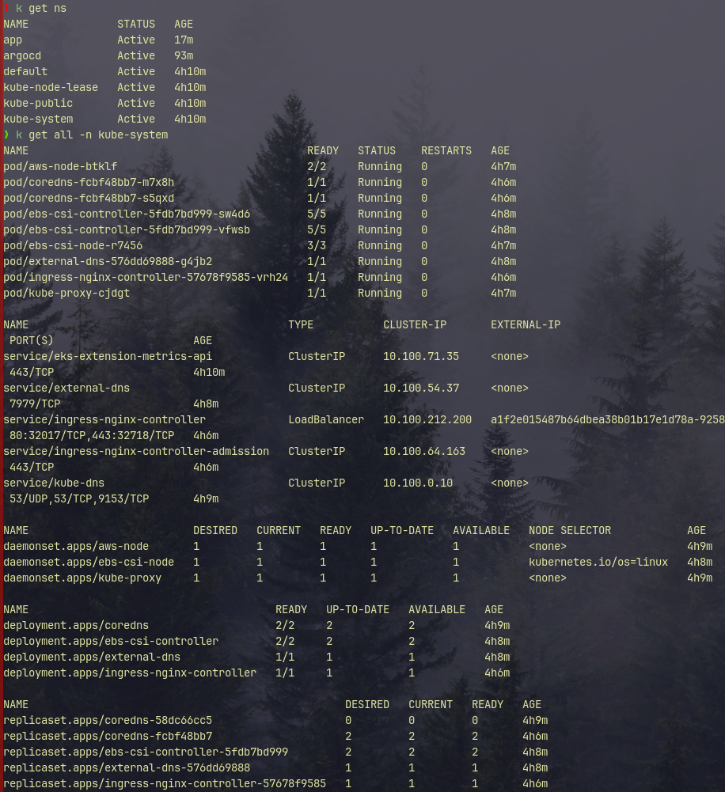
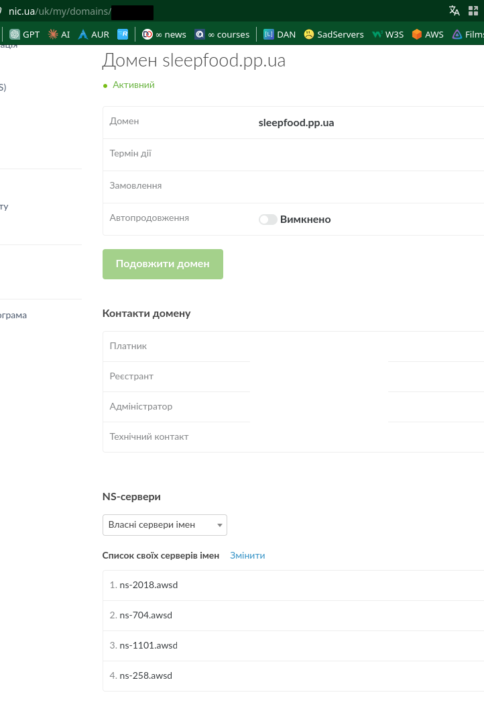
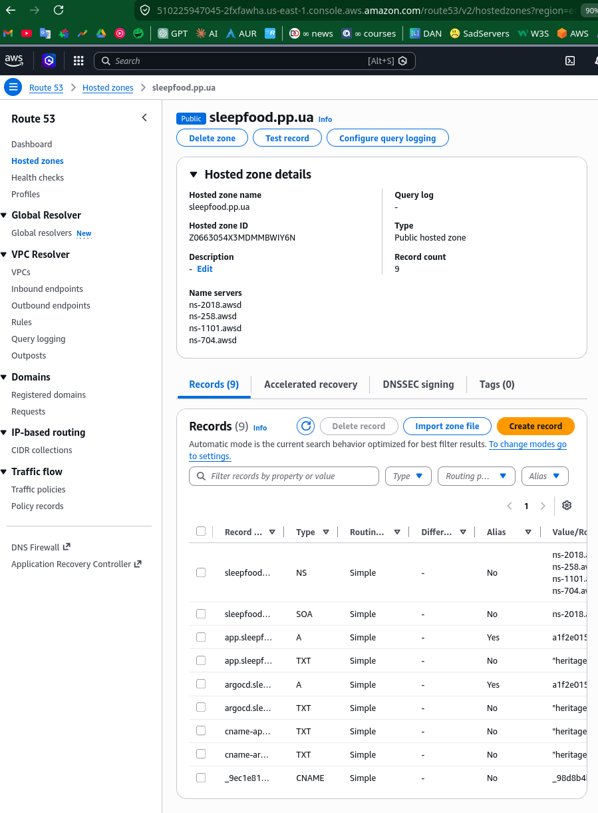

# terraform-aws-k8s-cicd

> End-to-end **GitOps** pipeline on **AWS EKS** — provisioned with **Terraform**, built by **GitHub Actions**, and continuously delivered by **ArgoCD**. A practical demonstration of Infrastructure-as-Code, container CI, GitOps CD, and DNS automation, all wired into a single workflow: *git push → live cluster*.

This project provisions a production-style Kubernetes platform on AWS and deploys a small Python/Flask backend to it. Every component — VPC integration, EKS cluster, ingress controller, ArgoCD, ACM certs, external-dns, and the ArgoCD `Application` itself — is declared in Terraform and reconciled automatically. Once bootstrapped, the only manual step in the day-to-day loop is `git push`.

---

## 📦 Tech Stack


| Layer            | Tool / Service                                                  |
| ---------------- | --------------------------------------------------------------- |
| Application      | Python 3.14 + Flask (returns `200` on `/`, listens on `:1447`)  |
| Container        | Docker, Docker Hub registry (`sleepfood/backend`)               |
| CI               | GitHub Actions — build & push on every commit to `main`         |
| IaC              | Terraform (AWS, Helm, kubectl providers)                        |
| State backend    | S3 (`sleepfood-terraform-state`, encrypted, native locking)     |
| Orchestration    | AWS EKS (1 node group, 1 worker)                                |
| Ingress          | `ingress-nginx` (Helm release in Terraform)                     |
| GitOps CD        | Argo CD (Helm chart `5.55.0`, auto-sync + self-heal)            |
| DNS              | Route 53 + `external-dns` (records auto-managed by the cluster) |
| TLS              | AWS ACM                                                         |
| Domain           | `sleepfood.pp.ua` (registered at nic.ua, NS delegated to AWS)   |

---

## 🏗️ Architecture



ASCII fallback:

```
Developer ──git push──▶ GitHub ──▶ GitHub Actions ──build/push──▶ Docker Hub
                          │                                            ▲
                          │ (k8s/ manifests)                           │ pull image
                          ▼                                            │
                       ArgoCD ──sync──▶ EKS Cluster (ns: app) ─────────┘
                                                │
                                                ▼
                                     ingress-nginx + NLB
                                                │
                                       external-dns → Route 53
                                                │
                                                ▼
                                            End User
```

---

## 📁 Project Structure

```
.
├── app/                          # Python Flask backend
│   ├── main.py
│   └── requirements.txt
├── Dockerfile
├── .github/workflows/
│   └── docker-image.yml          # GitHub Actions: build & push to Docker Hub
├── k8s/                          # Reconciled by ArgoCD
│   ├── ns.yaml                   # Namespace: app
│   ├── dp.yaml                   # Deployment
│   ├── svc.yaml                  # Service (ClusterIP, :1447)
│   └── ing.yaml                  # Ingress (app.sleepfood.pp.ua)
├── argocd/
│   └── application.yaml          # ArgoCD Application manifest
├── terraform/
│   ├── s3_backend/               # Bootstraps the S3 state bucket
│   └── EKS/                      # Main infrastructure
│       ├── eks-cluster.tf
│       ├── eks-worker-nodes.tf
│       ├── ingress_controller.tf # ingress-nginx via Helm
│       ├── argocd.tf             # Argo CD via Helm + Application
│       ├── eks-external-dns.tf
│       ├── acm.tf
│       ├── ebs-csi.tf
│       ├── iam.tf
│       ├── sg.tf
│       ├── provider.tf
│       ├── backend.tf
│       ├── variables.tf
│       └── terraform.tfvars
└── screens/                      # Setup screenshots
```

---

## 🌐 Live URLs

| Service        | URL                                                       |
| -------------- | --------------------------------------------------------- |
| Application    | http://app.sleepfood.pp.ua                                |
| Argo CD UI     | https://argocd.sleepfood.pp.ua                            |

---

## 🔧 Prerequisites

| Tool         | Notes                                                                |
| ------------ | -------------------------------------------------------------------- |
| AWS CLI      | Configured with credentials that can create EKS / IAM / Route 53     |
| Terraform    | `>= 1.6` (uses S3 native locking via `use_lockfile`)                 |
| `kubectl`    | Any recent version                                                   |
| Helm         | `>= 3.x`                                                             |
| Docker Hub   | Account + Personal Access Token (used by CI)                         |
| Domain       | A Route 53 hosted zone (this project uses `sleepfood.pp.ua`)         |

---

## 🚀 Setup

### Step 1 — Bootstrap the Terraform state backend

```bash
cd terraform/s3_backend
terraform init
terraform apply
```

This creates the S3 bucket `sleepfood-terraform-state` used by the EKS stack's remote state.

### Step 2 — Configure GitHub Actions credentials

In the GitHub repo, open **Settings → Environments → `dockerhub`** and add:

| Kind        | Name                  | Value                                |
| ----------- | --------------------- | ------------------------------------ |
| Variable    | `DOCKERHUB_USERNAME`  | Your Docker Hub username             |
| Secret      | `DOCKERHUB_TOKEN`     | Docker Hub Personal Access Token     |

> The workflow references them as `${{ vars.DOCKERHUB_USERNAME }}` and `${{ secrets.DOCKERHUB_TOKEN }}`. Keep the username as a *variable* (non-sensitive) and the token as a *secret*.



### Step 3 — Deploy the infrastructure

```bash
cd terraform/EKS
terraform init
terraform apply
```

This provisions:

- the EKS cluster (`danit`) and a single-node worker group,
- the `ingress-nginx` Helm release,
- ACM cert + `external-dns`,
- Argo CD (Helm chart `5.55.0`) with its own ingress at `argocd.sleepfood.pp.ua`,
- the ArgoCD `Application` that points at `k8s/` in this repo.

### Step 4 — Wire up `kubectl`

```bash
aws eks update-kubeconfig --region eu-central-1 --name danit
kubectl get nodes
```

### Step 5 — Grab the initial ArgoCD admin password

```bash
kubectl -n argocd get secret argocd-initial-admin-secret \
  -o jsonpath="{.data.password}" | base64 -d && echo
```

User: `admin` · Password: *output above*.



### Step 6 — Open the UI / app

- Argo CD: <https://argocd.sleepfood.pp.ua>
- App:     <http://app.sleepfood.pp.ua>

DNS records are created automatically by `external-dns`; allow a minute or two for propagation after the first apply.

<p align="center">
  
  
</p>

---

## 🔁 How the GitOps loop works

```
┌─ Developer commits to main ─────────────────────────────────────────┐
│                                                                     │
│  1. GitHub Actions builds the Docker image and pushes two tags:     │
│        sleepfood/backend:latest                                     │
│        sleepfood/backend:<commit-sha>                               │
│                                                                     │
│  2. ArgoCD continuously watches k8s/ in this repo. Any change to    │
│     the manifests (e.g. bumping the image tag) is auto-synced to    │
│     the cluster, with prune + self-heal enabled.                    │
│                                                                     │
│  3. The Deployment rolls the new pods. ingress-nginx routes traffic │
│     via the NLB; external-dns keeps the Route 53 A record in sync.  │
│                                                                     │
└─────────────────────────────────────────────────────────────────────┘
```

- App code change → CI rebuilds image (`:latest` and `:<sha>`). The deployment uses `:latest`, so a new pod will pull the new image on the next rollout.
- Manifest change in `k8s/` → ArgoCD detects drift and reconciles automatically (`syncPolicy.automated.prune: true`, `selfHeal: true`).
- Cluster-level changes (ingress controller, ArgoCD config, IAM, etc.) → `terraform apply`.

**The `app` Application synced and healthy in Argo CD:**



**Configuration view of the same Application:**



**Platform pods running in `kube-system` (ingress-nginx, external-dns, coredns, ebs-csi, …):**



---

## 🧹 Cleanup

```bash
cd terraform/EKS
terraform destroy
```

If `destroy` hangs on the `argocd` namespace, ArgoCD CRDs may still hold finalizers. Remove them manually:

```bash
kubectl delete crd applications.argoproj.io \
                  applicationsets.argoproj.io \
                  appprojects.argoproj.io
```

Then re-run `terraform destroy`. Finally tear down the state bucket if you no longer need it:

```bash
cd ../s3_backend
terraform destroy
```

---

## 💰 Cost Estimate

| Component                              | Approx. daily cost |
| -------------------------------------- | ------------------ |
| EKS control plane (`$0.10/hr`)         | ~$2.40             |
| 1 × t3.medium worker node              | ~$1.00             |
| Network Load Balancer (ingress-nginx)  | ~$0.55             |
| Route 53 hosted zone                   | ~$0.02             |
| **Total**                              | **~$1.65–$4/day**  |

> Numbers vary by region and instance type. The cluster is intentionally minimal (1 node) to stay cheap for a learning project. `terraform destroy` when you're done.

---

## 🌐 DNS Setup

The domain `sleepfood.pp.ua` was registered at **nic.ua** and delegated to AWS by replacing the registrar's NS records with Route 53's:



Once delegated, AWS owns the zone and `external-dns` writes records into it directly from ingress hostnames — no manual record management:



---

## 🛠️ Troubleshooting

### ArgoCD ingress shows `example.com` instead of `argocd.sleepfood.pp.ua`
Newer versions of the `argo-cd` Helm chart changed the ingress schema. This project pins the chart to **`5.55.0`** in `argocd.tf`. If you upgrade, expect to migrate the `server.ingress.*` values to the new format (`server.ingress.hostname` / `extraHosts`, etc.).

### `redis-ha` pods stuck pending
The HA Redis sub-chart requires **3 nodes** with anti-affinity. On a single-node cluster, leave `redis-ha.enabled = false` (the default). Use regular `redis` instead.

### LoadBalancer `EXTERNAL-IP` changes after `destroy` / `apply`
Every fresh apply provisions a new NLB with a new hostname. This is fine — `external-dns` updates the Route 53 A records automatically. If `dig app.sleepfood.pp.ua` still shows the old address, wait for the TTL to expire or check the `external-dns` pod logs:

```bash
kubectl -n kube-system logs deploy/external-dns
```

### ACM cert stuck in `PENDING_VALIDATION`
The DNS validation record must live in the Route 53 hosted zone for the domain. Confirm the zone exists, your registrar's NS records point at AWS, and that Terraform has permission to create records.

### ArgoCD `Application` shows `Unknown` / cannot reach repo
Check the `repoURL` in `argocd/application.yaml`. For a public repo no credentials are required; for private repos you'll need to register them in Argo CD (`Settings → Repositories`).

---

## 🎓 What this project demonstrates

- **Infrastructure as Code** — every cloud resource (VPC wiring, EKS, IAM, ACM, ingress, ArgoCD, external-dns) is in Terraform with remote, encrypted, locked state.
- **CI/CD separation** — GitHub Actions handles *image build* only; ArgoCD handles *deployment*. Each concern lives where it belongs.
- **GitOps** — the cluster's desired state lives in git; ArgoCD reconciles continuously with prune + self-heal.
- **DNS automation** — `external-dns` removes manual record management entirely; ingress hostnames are the source of truth.
- **Reproducibility** — the entire platform can be torn down and rebuilt from this repo with two `terraform apply`s and zero clicks in the AWS console.
